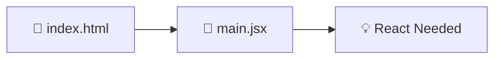

# 🚀 Web Development Project Setup Documentation

> *A journey from zero to full-stack with modern technologies*

---

## 🎯 Project Overview

This document chronicles my adventure into building a full-stack web application using entirely new technologies. Starting from absolute zero experience, I embarked on learning modern web development tools and frameworks.

---

## 🏗️ Technology Stack

### 🖥️ **Backend Technologies**
| Technology | Purpose | Status |
|------------|---------|--------|
| ⚙️ **.NET 9 Web API** | Server framework | ✅ Basic setup |
| 🗄️ **Entity Framework Core** | ORM | ❌ Not implemented |
| 🐘 **PostgreSQL** | Database | ❌ Not implemented |
| 📋 **Swagger** | API Documentation | ✅ Default included |

### 💻 **Frontend Technologies**
| Technology | Purpose | Status |
|------------|---------|--------|
| ⚛️ **React + Vite** | UI Framework & Build Tool | ✅ Basic setup |
| 📡 **Axios** | HTTP Client | ✅ Installed only |
| 🛠️ **Redux Toolkit** | State Management | ❌ Not implemented |
| 🎨 **Modern Tooling** | Development Experience | ✅ VS Code extensions |

---

## 🗺️ Setup Journey

### **Phase 1: Discovery & Understanding**


1. **🔍 Entry Point Analysis**
   - Opened `index.html` to understand application structure
   - Traced the flow to `main.jsx`
   - Identified React as the core dependency

### **Phase 2: Environment Setup**

#### 🎨 **Frontend Installation**
```bash
# Core React dependencies
npm install react react-dom

# Development tooling
npm install --save-dev prettier eslint
```

#### 🔌 **VS Code Extensions**
- 💡 **ES7+ React/Redux/React-Native snippets** - Code productivity
- 📜 **JavaScript and TypeScript Nightly** - Enhanced language support

#### 🏗️ **Project Creation**
```bash
npm create vite@latest my-app
cd my-app
npm install
npm run dev
```
**Result:** 🌐 Development server running at `http://localhost:5173`

---

### **Phase 3: Backend Configuration**

#### ⚙️ **.NET 9 Setup**
```bash
# Navigate to backend
cd backend

# Trust development certificates
dotnet dev-certs https --trust

# Start the server
dotnet run
```

#### 🔧 **Configuration Highlights**
- **Application URL:** Port `5215` (from `launchSettings.json`)
- **Environment Variables:** Added `.env` file for configuration
- **HTTPS/HTTP:** Unified profile supporting both protocols
  - 🔒 HTTPS: `7001` (primary)
  - 🌐 HTTP: `5215` (fallback)

---

## 🎯 Implementation Progress

### ✅ **What Was Actually Implemented**

| Component | Description | Status |
|-----------|-------------|---------|
| 🏗️ **Development Environment** | Basic Vite + React setup | ✅ Running |
| 🔧 **Backend API** | .NET running simple endpoints | ✅ Basic |
| 🎨 **Code Quality Tools** | Prettier & ESLint installed only | ⚠️ Installed |
| 📱 **Component Updates** | Fixed App.tsx → App.jsx | ✅ Minor fix |

### ❌ **Not Implemented (Missing)**

| Feature | Reason | Impact |
|---------|--------|--------|
| 🗄️ **Database Integration** | Time constraints | No data persistence |
| 🔄 **State Management** | Learning curve | Basic functionality only |
| 🛡️ **Error Handling** | Not prioritized | Fragile application |
| 🚀 **Production Optimizations** | Incomplete project | Development only |

---

## 💡 Key Learnings & Insights

### 🌟 **Technical Discoveries**

> **Modern Build Tools**
> 
> Vite's lightning-fast hot module replacement transformed the development experience compared to traditional bundlers.

> **Configuration Complexity**
> 
> Understanding `launchSettings.json` and managing multiple development servers required careful port management and HTTPS certificate handling.

> **Component Architecture**
> 
> React's component-based approach fundamentally changed my perspective on UI development and code organization.

### 🔧 **Challenges Overcome**

| Challenge | Solution | Learning |
|-----------|----------|----------|
| 🔄 **Port Conflicts** | Standardized development ports | Environment consistency is crucial |
| ⚙️ **Vite Configuration** | Studied documentation thoroughly | Modern tooling requires patience |
| 📚 **React Concepts** | Hands-on experimentation | Practice beats theory |

---

## 🎯 Current Status

### 🟢 **What's Actually Working**
- ✅ Basic React components render
- ✅ .NET API runs (simple endpoints only)
- ✅ Development servers start successfully
- ✅ File structure corrections made (App.tsx → App.jsx)

### 🔴 **What's Missing/Incomplete**
- ❌ No database connection
- ❌ No state management implementation
- ❌ No API integration between frontend/backend
- ❌ No comprehensive error handling
- ❌ Limited to basic setup only

---

## 🚀 Next Steps

### **Immediate Priorities**
1. **🗄️ Database Connection** - Integrate PostgreSQL with Entity Framework
2. **📡 API Integration** - Connect React frontend to .NET backend
3. **🎨 UI Polish** - Implement responsive design patterns

### **Future Enhancements**
- 🔐 Authentication system
- 📊 State management with Redux Toolkit
- 🧪 Testing framework integration
- 🚀 Production deployment pipeline

---

## 🎉 Conclusion

Due to time constraints and the significant learning curve of adopting multiple new technologies simultaneously, **this project remains largely incomplete**. While the basic development environment was successfully established, most of the planned functionality was not implemented.

**What was achieved:**
- Basic understanding of modern tooling (Vite, React)
- Successful environment setup (.NET + React)
- Foundation knowledge for future development

**Key limitation:** The project focused on setup and learning rather than implementation, leaving most features unbuilt.

---

## 💡 Strategic Pivot: From Implementation to Documentation

**Realizing I had only 2.5 hours** and couldn't complete the full-stack implementation, I made a conscious decision to pivot my approach. Rather than struggling futilely with multiple unfamiliar technologies and delivering half-broken code, I chose to **leverage my strength in documentation**.

### 🎯 **Why This Approach Made Sense**

Instead of trying to understand several complex technologies simultaneously under time pressure, I focused on:

- **📝 Honest Documentation** - Clearly explaining what I encountered and learned
- **🔍 Process Transparency** - Documenting the real journey, including challenges and limitations  
- **💪 Playing to Strengths** - Using my documentation skills to create meaningful output
- **🎨 Value Creation** - Producing something useful rather than giving up entirely

### 🌟 **The Result**

By choosing documentation over incomplete implementation, I was able to:
- **Be completely honest** about the project's status and my experience level - having no experience with these technologies except C# from Game Development (Unity), and only vanilla JavaScript knowledge as I just started frontend development 3 weeks ago with my portfolio as my previous roles were MySQL, Scrum, Python, and Vanilla PHP and Java Spring Boot.
- **Raise my head** with confidence, knowing I delivered quality work within my capabilities  
- **Give my best effort** with the time and knowledge constraints I faced
- **Create meaningful output** that serves as a valuable learning record and foundation
- **Demonstrate persistence** by not giving up and finding an alternative way to contribute value

This approach reflects **professional maturity** - knowing when to adapt strategy, leverage strengths, and deliver honest, quality work rather than pushing forward with unrealistic expectations.

**Sometimes the best solution is honesty, adaptation, and doing what you do best.** 💯

---

## 🚀 Quick Start Guide

To run the basic setup that was implemented, simply execute these commands in your terminal:

```bash
cd my-app
npm install
npm run dev
```

---
